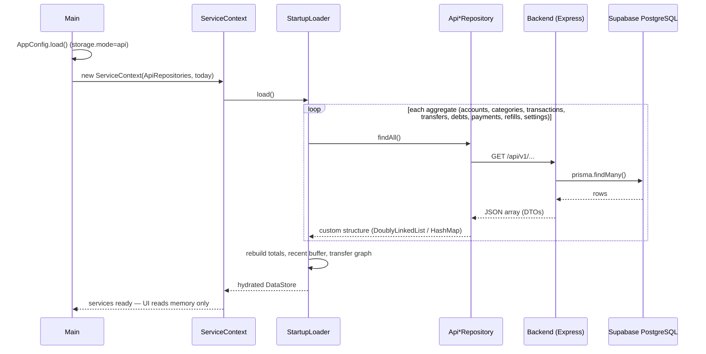
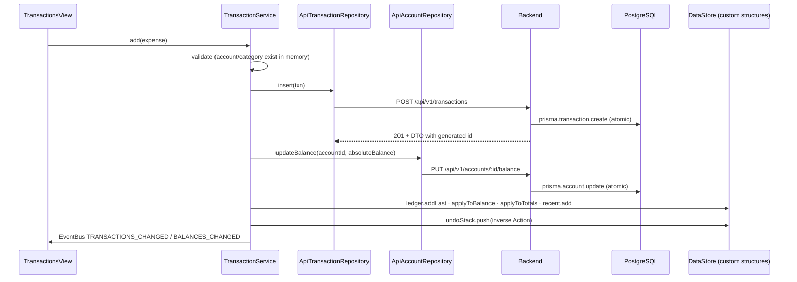
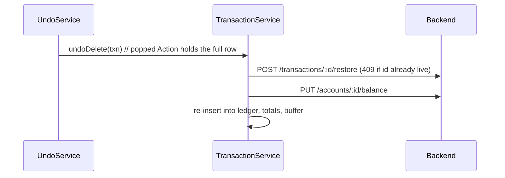

# Budget Guardian — Cloud Persistence Architecture

This document describes how the desktop application persists data through a
REST backend into Supabase PostgreSQL, why it is built that way, and the
decisions (ADRs) behind it.

The one rule everything else follows: **the custom data structures remain the
application's working memory and processing engine.** The database — SQLite
locally or PostgreSQL in the cloud — is persistent storage only. No algorithm
was replaced by a SQL query.

---

## 1. The big picture

```
┌────────────────────────────── Desktop (Java 21 / JavaFX) ─────────────────────────────┐
│                                                                                       │
│  JavaFX UI ──► Service layer ──► Custom data structures (DataStore)                   │
│                   │                    DoublyLinkedList · HashMap · Stack ·           │
│                   │                    CircularBuffer · PriorityQueue · Graph         │
│                   ▼                                                                   │
│            Repository interfaces  (AccountRepository, TransactionRepository, ...)     │
│              ├── repository/sqlite   → JDBC → SQLite file          (storage.mode=local)│
│              └── repository/api      → HttpJsonClient (JSON/HTTP)  (storage.mode=api) │
└──────────────────────────────────────────┬────────────────────────────────────────────┘
                                           │ HTTPS  (base URL + optional X-API-Key;
                                           │         no DB credentials on the desktop)
                                           ▼
                              Node.js backend (Express 5)
                       routes → zod validation → controllers → services
                                           │
                                           ▼
                                     Prisma ORM
                                           │
                                           ▼
                              Supabase PostgreSQL (pooled)
```

- The UI never touches HTTP or SQL. It reads `DataStore` and calls services.
- Services never know the storage backend. They depend on repository
  **interfaces** and a `TransactionRunner`, and catch only `StorageException`.
- The desktop never connects to PostgreSQL and never holds database
  credentials. Secrets live in `backend/.env` only.

## 2. Repository pattern

```
repository/                     interfaces + StorageException + Repositories bundle
repository/sqlite/              JDBC implementations (local mode, the original code)
repository/api/                 REST implementations (cloud mode)
```

`Repositories` is a record bundling all seven repositories plus the
`TransactionRunner`. The composition root (`Main` via `AppConfig`) picks the
factory once:

- `SqliteRepositories.create(connection)`
- `ApiRepositories.create(httpJsonClient)`

`ServiceContext` — and therefore every service, the rule engine, undo and
notifications — is identical in both modes.

Supporting packages, used only by `repository/api`:

- `dto/` — plain wire carriers (public fields, Gson-friendly, arrays not
  Lists so the guarded packages stay free of `java.util` collections).
- `mapper/` — the only place DTOs meet domain records; round-trip tested.
- `network/` — `HttpJsonClient`, the single HTTP entry point: timeouts,
  retry with backoff for idempotent verbs (GET/PUT only), automatic
  Gson (de)serialization, backend error-shape extraction, optional
  `X-API-Key` header.

## 3. Startup (download → hydrate → run)



After hydration the backend is write-only until the next start, exactly as
SQLite was.

## 4. Write path (every mutation)



Persist-first, memory-second. If any remote call fails, the service throws
`BudgetException` **before** memory is touched — the UI shows the message and
in-memory state stays consistent with what the user last saw succeed.

### Undo of a delete (original id restore)



## 5. Error handling & retries

| Failure | Where handled | Result |
|---|---|---|
| Backend unreachable at startup | `Main` | Friendly dialog naming the URL and the config file to fix, then clean exit |
| Transport error on GET/PUT | `HttpJsonClient` | Retried with linear backoff (`api.retries`, default 2) — GET is safe, PUT bodies carry absolute state |
| Transport error on POST/DELETE | `HttpJsonClient` | **Never retried** (duplicate risk); surfaced immediately |
| Non-2xx response | `HttpJsonClient` → `ApiException(status)` | Wrapped into `StorageException` by the repository, into `BudgetException` by the service; UI shows the backend's `error.message` |
| Any remote failure during a mutation | Service layer | Memory untouched; the user can simply retry the action |

## 6. Consistency model and the future sync queue

In local mode, `SqliteTransactionRunner` wraps multi-statement work
(insert row + update balance) in a real SQL transaction.

In API mode, `ApiTransactionRunner` executes the same work as sequential
HTTP calls. **Each endpoint is atomic server-side**, but the pair is not
atomic across calls: if the balance write fails after the row insert
succeeded, the remote row exists while the desktop (correctly) reports an
error and keeps memory unchanged. For a single-user personal ledger this
window is tiny and always visible (balances are absolute, so any later
successful mutation self-heals the account balance).

The repository layer was shaped so an **offline sync queue** can close this
gap without touching services:

1. Wrap the `Repositories` bundle in a decorating implementation that
   journals every mutation (entity, verb, payload) to a local queue.
2. `ApiTransactionRunner.run()` becomes the queue's commit boundary — the
   journaled batch is shipped to a `/batch` endpoint executed in one
   `prisma.$transaction`, or replayed later when connectivity returns.
3. Ids for offline inserts come from a client-reserved range (the restore
   endpoint already proves the backend accepts explicit ids).

Nothing in the service layer changes when that lands — the seam is the
`TransactionRunner` interface plus the bundle factory.

## 7. Architecture decision records

### ADR-1 — REST tier between desktop and database
**Decision:** the desktop talks only to a Node/Express backend; Prisma talks
to PostgreSQL. **Why:** credentials never leave the server (`.env`), input is
validated twice (client-side sanity, zod server-side), the database can move
(Supabase → RDS → anything Prisma supports) without shipping a new desktop
build, and server-side atomic endpoints give a place to hang auth, auditing
and the future sync queue. **Rejected:** direct JDBC-to-Supabase — leaks
credentials into a distributable binary and couples every client to the
schema.

### ADR-2 — BIGSERIAL ids, not UUIDs
**Decision:** PostgreSQL keeps auto-increment `BIGINT` primary keys
(`TEXT` for the four fixed accounts, `INTEGER` for the eleven fixed
categories, `name`/`key` for refills/settings) — exactly the identity shapes
the Java records already use. **Why:** the domain records (`Transaction.id`
is a `long`, undo restores rows by original id) are explicitly off-limits;
UUID keys would force model, undo and UI changes for zero benefit in a
single-user system. **Trade-off:** multi-writer id collisions are a
non-issue today; if multi-device sync ever needs globally unique ids, a
`uuid` column can be added alongside without breaking the wire contract.

### ADR-3 — Persist-first, memory-second (unchanged from SQLite)
The original write order was chosen so a crash never leaves memory ahead of
disk. The REST integration keeps it: a failed remote save aborts the
operation before any custom structure mutates, which is also exactly the
"keep local memory intact, support retry" behavior wanted for a flaky
network.

### ADR-4 — Wire conventions: satang integers, naive-UTC dates
Money crosses the wire as integer satang (JSON numbers; a personal ledger is
orders of magnitude below 2^53). Dates cross as `yyyy-MM-dd`, timestamps as
zone-less ISO (`yyyy-MM-ddTHH:mm:ss`) interpreted as UTC on the server
(`backend/src/utils/dates.js`), so `LocalDate`/`LocalDateTime` round-trip
byte-for-byte regardless of server timezone. No floats, no zone math, no
drift.

### ADR-5 — Optional shared-secret auth now, real auth later
A single `X-API-Key` (timing-safe compare, enabled by setting `API_KEY` in
`.env`) fits a personal single-user deployment. The middleware seam
(`backend/src/middleware/apiKeyAuth.js`) is where JWT/Supabase Auth would
slot in if the app ever grows users; `users`-table scoping was deliberately
not built speculatively.
